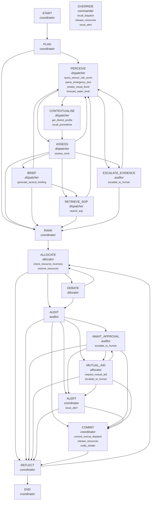

# Stage 06 workflow

**Goal.** Stabilise every zone of a multi-zone flood incident: each URGENT or CRITICAL zone receives assets or an explicit shortage escalation, every consequential action is signed off by a human, and no zone without evidence is dispatched to blind.

## Agents

- **coordinator** — Coordinator: owns the goal, runs the loop, ranks zones, reflects on the run
- **dispatcher** — Tactical Dispatcher: perceives each zone through the Stage 01-04 tools and fuses the evidence
- **allocator** — Resource Allocator: turns ranked needs into reservations against a finite inventory
- **auditor** — Safety Auditor: applies the safety rules and routes anything consequential to a human
- **commander** — Human incident commander: approves, rejects, overrides or halts

## State graph

## Task decomposition and tool mapping

| Task | Node | Agent | Tool | Trigger |
| --- | --- | --- | --- | --- |
| T0 Plan the whole response first | PLAN | coordinator | `-` | no tool: internal reasoning |
| T1 Perceive each zone | PERCEIVE | dispatcher | `query_sensor_risk_score` | zone has sensor readings |
| T1 Perceive each zone | PERCEIVE | dispatcher | `parse_emergency_text` | zone has a text report |
| T1 Perceive each zone | PERCEIVE | dispatcher | `predict_visual_flood` | zone has an image |
| T1 Perceive each zone | PERCEIVE | dispatcher | `forecast_water_level` | zone has a 72 h gauge history |
| T2 Add historical context | CONTEXTUALISE | dispatcher | `get_district_profile` | state and district are known |
| T2 Add historical context | CONTEXTUALISE | dispatcher | `recall_precedents` | memory holds past decisions for the district |
| T3 Fuse evidence into a priority | ASSESS | dispatcher | `assess_zone` | at least one evidence stream exists |
| T4 Brief the incident log | BRIEF | dispatcher | `generate_tactical_briefing` | zone has a multi-entry incident log |
| T5 Ground the response in SOPs | RETRIEVE_SOP | dispatcher | `search_sop` | fused priority is ELEVATED or higher |
| T6 Handle zones with no evidence | ESCALATE_EVIDENCE | auditor | `escalate_to_human` | no evidence stream, or fusion returned insufficient_evidence |
| T7 Rank zones and reason through trade-offs | RANK | coordinator | `-` | no tool: internal reasoning |
| T8 Explore allocation plans and reserve | ALLOCATE | allocator | `check_resource_inventory` | start of allocation |
| T8 Explore allocation plans and reserve | ALLOCATE | allocator | `reserve_resources` | a ranked zone needs a resource type that is in stock |
| T8b Debate and negotiate contested units | DEBATE | allocator | `-` | no tool: internal reasoning |
| T9 Audit proposed actions | AUDIT | auditor | `-` | no tool: internal reasoning |
| T10 Hold consequential actions for sign-off | AWAIT_APPROVAL | auditor | `escalate_to_human` | verdict is requires_human_approval |
| T11 Close shortfalls | MUTUAL_AID | allocator | `request_mutual_aid` | need exceeds remaining inventory |
| T11 Close shortfalls | MUTUAL_AID | allocator | `escalate_to_human` | a shortfall exists |
| T12 Issue cleared alerts | ALERT | coordinator | `issue_alert` | verdict is auto_approved |
| T13 Commit or release | COMMIT | coordinator | `commit_rescue_dispatch` | a human approved the action |
| T13 Commit or release | COMMIT | coordinator | `notify_shelter` | an approved dispatch includes an evacuation |
| T13 Commit or release | COMMIT | coordinator | `release_resources` | a human rejected the action |
| T14 Reflect and revise | REFLECT | coordinator | `-` | no tool: internal reasoning |
| T15 Honour an emergency override | OVERRIDE | commander | `recall_dispatch` | a committed dispatch is overridden |
| T15 Honour an emergency override | OVERRIDE | commander | `release_resources` | a pending action is cancelled |
| T15 Honour an emergency override | OVERRIDE | commander | `issue_alert` | a standby alert is stood down |

## Plan check example

Goal: evacuate a zone. Plan: check ambulance availability → check ambulance availability → notify shelter of incoming evacuees.

`check_plan()` → S2 repeats S1 (check ambulance availability); no step calls commit_rescue_dispatch

## Reasoning, coordination and control patterns

| Family | Pattern | Status | Where |
| --- | --- | --- | --- |
| reasoning | ReAct | implemented | every step records a thought, the tool it calls and the observation (03, RunContext) |
| reasoning | Plan-and-Execute | implemented | PLAN node writes the full plan first; check_plan() audits it; adherence reported (03, 04) |
| reasoning | Reflexion | implemented | REFLECT revises the allocation once when units were freed while zones stay short (03) |
| reasoning | Tree of Thoughts | implemented | ALLOCATE scores three allocation plans with an explicit utility and keeps the best (03) |
| reasoning | Function / Tool Calling | implemented | schema-validated tool registry, also served over MCP (01, 03, 05) |
| reasoning | Memory-Augmented Agent | implemented | recall_precedents reads past agent and commander decisions for the district (03) |
| reasoning | Multi-Agent Debate | implemented | DEBATE: the Safety Auditor challenges the allocator's proposal; consensus recorded (03) |
| reasoning | Human-in-the-Loop | implemented | approval tokens, confidence escalation, emergency override (03, 05) |
| coordination | Orchestrator-Worker | implemented | Coordinator delegates to Dispatcher, Allocator, Auditor |
| coordination | Peer-to-Peer Negotiation | implemented | zones bid for contested units in DEBATE; the agreement and the rerouted zones are recorded |
| coordination | Blackboard / Shared Memory | implemented | RunState.blackboard: every agent posts its findings to one shared workspace |
| coordination | Hierarchical Agents | implemented | escalations routed to field supervisor, district EOC, state EOC or incident commander |
| coordination | Swarm Coordination | not applicable | needs many simple autonomous agents acting locally; one incident command does not fit it |
| control | Approval Gate | implemented | commit_rescue_dispatch refuses held actions without a human token |
| control | Emergency Override | implemented | CoordinationAgent.override(): halt the run, recall committed dispatches |
| control | Confidence Threshold | implemented | decision confidence per zone; below the threshold a dispatch is escalated (rule R10) |
| control | Audit Trail | implemented | trajectory, blackboard, human events and the dispatch ledger |
| control | Guardrails / Policy Constraints | implemented | Safety Auditor rules R1-R10 |
